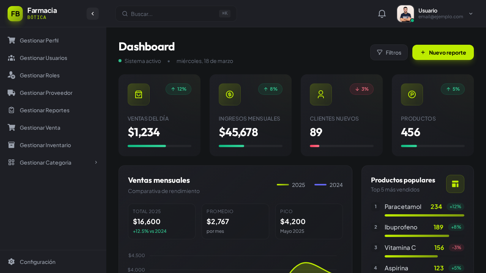

# Farmacia Bótica Dashboard

> Panel de administración para gestión de farmacia construido con React, TypeScript y Tailwind CSS.



## Características

| Característica | Descripción |
|----------------|-------------|
| 🔐 **Autenticación** | Iniciar sesión, Registro, Recuperar contraseña |
| 📊 **Dashboard** | Panel de administración con sidebar y header |
| 💊 **Gestión de Farmacia** | Productos, inventario, ventas, categorías |
| 💬 **Chat** | Sistema de chat integrado |
| 📱 **Responsive** | Soporte para móvil, tablet y escritorio |

## Tecnologías

<p>
  
  
  
  
  
  
</p>

## Inicio Rápido

```bash
# Clonar el repositorio
git clone https://github.com/MarcoEsteban/React-Tailwind_dashbord1-5_JoTreDev.git

# Instalar dependencias
npm install

# Iniciar servidor de desarrollo
npm run dev

# Compilar para producción
npm run build
```

## Paleta de Colores

<div align="center">

| Color | Hex | Uso |
|-------|-----|-----|
| 🟢 Primario | `#BDEB00` | Acentos, botones, destacados |
| 🌑 Sidebar | `#1E1F25` | Fondo de navegación |
| ⬛ Fondo | `#131517` | Fondo de página |

</div>

## Estructura del Proyecto

```
src/
├── components/       # Componentes UI reutilizables
├── layouts/          # Diseños de página (Auth, Admin)
├── pages/             # Páginas de rutas
│   ├── admin/        # Páginas del dashboard
│   └── auth/         # Páginas de autenticación
├── hooks/            # Hooks personalizados de React
├── stores/           # Stores de Zustand
├── types/            # Definiciones de TypeScript
└── utils/            # Funciones de utilidad
```

## Rutas

| Ruta | Página |
|------|--------|
| `/auth` | Iniciar sesión |
| `/auth/registro` | Registro |
| `/auth/olvide-password` | Recuperar contraseña |
| `/` | Inicio del Dashboard |
| `/chat` | Chat |

## Requisitos

- **Node.js** >= 16.x
- **npm** o **yarn**

---

<p align="center">
  Construido con ❤️ por <a href="https://github.com/MarcoEsteban">MarcoEsteban</a>
</p>
